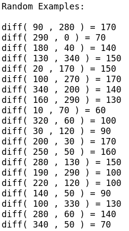

# Angle_Distance

Routine that calculates distance between angles.
It returns absolute difference between angles given in degrees

#### In one line of code:

    angle_dist = abs(((angle1 - angle2) + 180) % 360 - 180)
